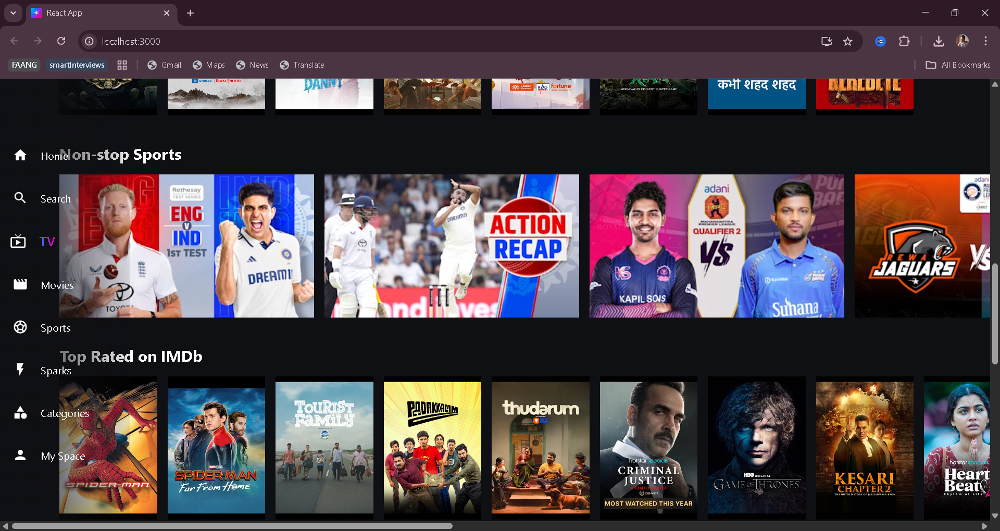

<h1 align="center">Hotstar Clone</h1>

  A visually stunning UI clone of Disney+ Hotstar built using React.js and CSS.

<h2>🖼️ Preview</h2>

  

<h2>✨ Features</h2>
<ul>
  <li>🔄 Scrollable card sections for various categories</li>
  <li>🎥 Hover cards with "▶ Watch Now", "＋ Add to List", and metadata</li>
  <li>📱 Fully responsive layout for all devices</li>
  <li>🎨 Custom CSS for transitions and smooth effects</li>
</ul>

<h2>🧱 Tech Stack</h2>
<table>
  <tr><td>React.js</td><td>Frontend Library</td></tr>
  <tr><td>CSS3</td><td>Styling & hover effects</td></tr>
  <tr><td>JSX</td><td>Component-based structure</td></tr>
  <tr><td>Git + GitHub</td><td>Version control & hosting</td></tr>
</table>

<h2>📂 Folder Structure</h2>

<pre>
hotstar-clone/
├── public/
│   └── images/
├── src/
│   ├── components/
│   │   ├── Navbar.js
│   │   ├── FeaturedSection.js
│   │   └── MoviePreviewCard.js
│   ├── App.js
│   ├── App.css
│   └── index.js
├── .gitignore
├── package.json
└── README.md
</pre>

<h2>🛠️ Getting Started</h2>
<ol>
  <li>Clone the repository:
    <pre><code>git clone https://github.com/siddhusiddharthachary/hotstar-clone.git</code></pre>
  </li>
  <li>Navigate to the project folder:
    <pre><code>cd hotstar-clone</code></pre>
  </li>
  <li>Install dependencies:
    <pre><code>npm install</code></pre>
  </li>
  <li>Start the development server:
    <pre><code>npm start</code></pre>
  </li>
</ol>

Now visit <strong>http://localhost:3000</strong> in your browser.

<h2>📈 Future Enhancements</h2>
<ul>
  <li>🌐 Add movie APIs like TMDB for dynamic data</li>
  <li>🔎 Implement search bar</li>
  <li>🔐 User login/signup page</li>
  <li>🎬 Video previews on hover</li>
</ul>

<h2>👨‍💻 Author</h2>

  <strong>R. Sai Siddhu</strong> 
  <a href="https://www.linkedin.com/in/rsaisiddhu" target="_blank">LinkedIn</a> |
  <a href="https://github.com/siddhusiddharthachary" target="_blank">GitHub</a>

<blockquote><em>"Building the frontend fire that lights up the user’s screen!"</em></blockquote>

<h2>📃 License</h2>

This project is free and open-source for educational and personal use.

